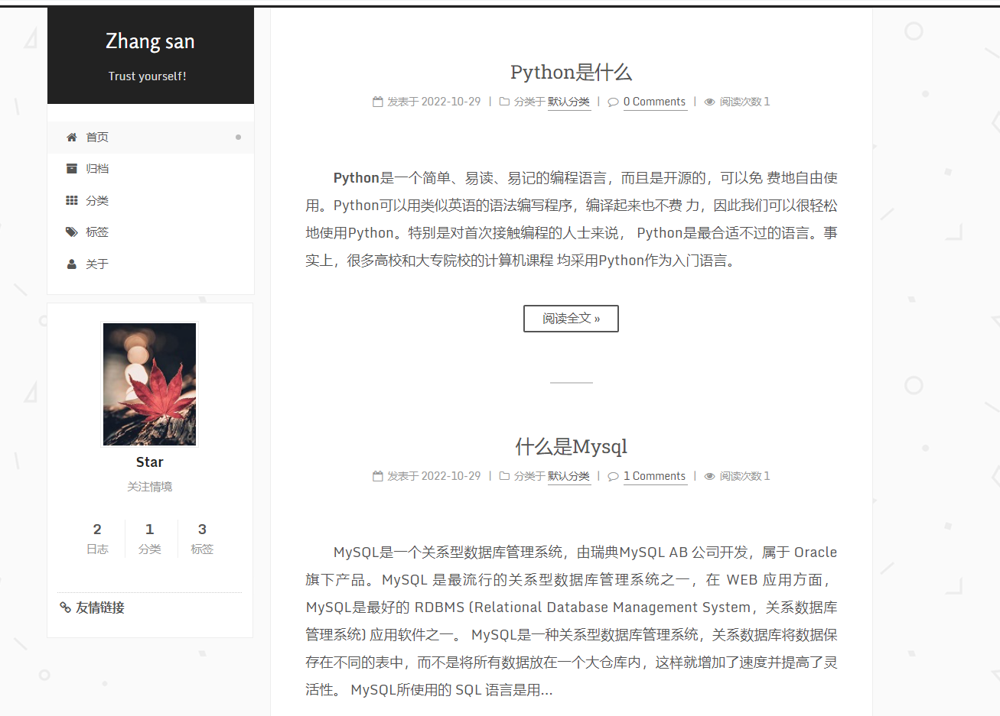
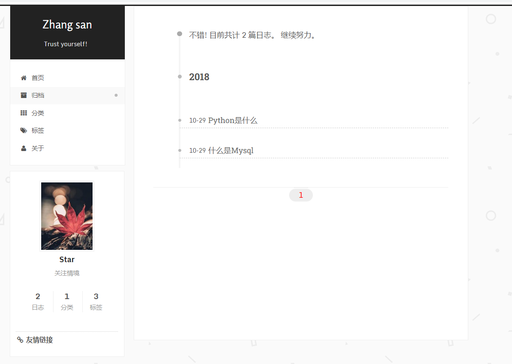
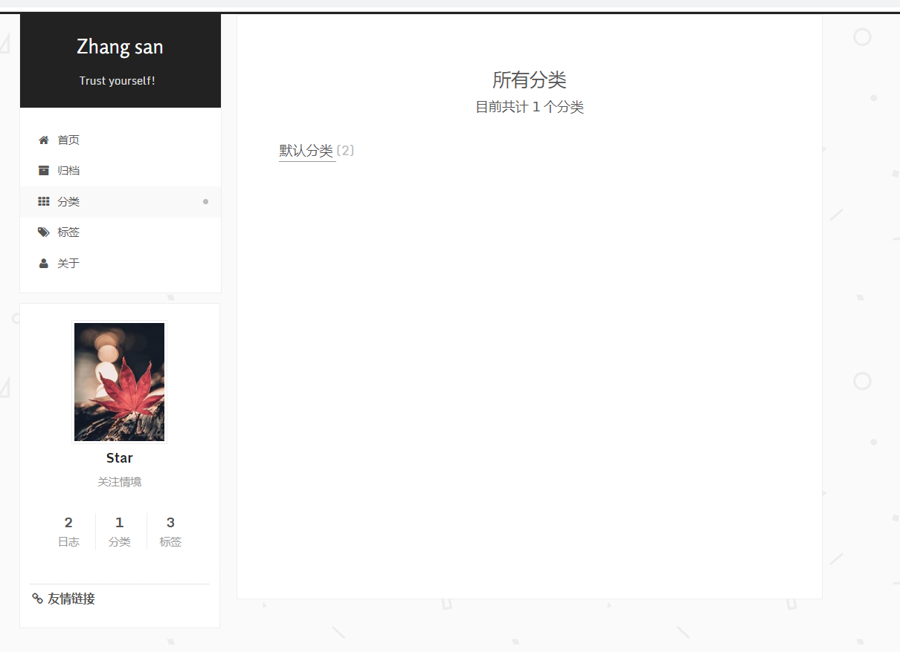
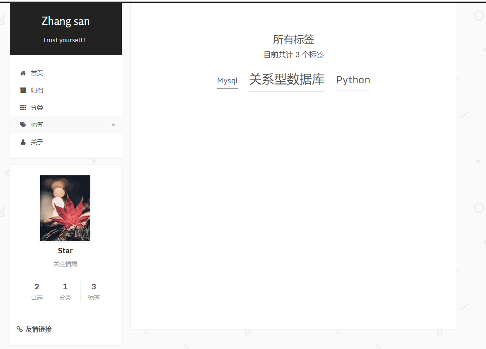
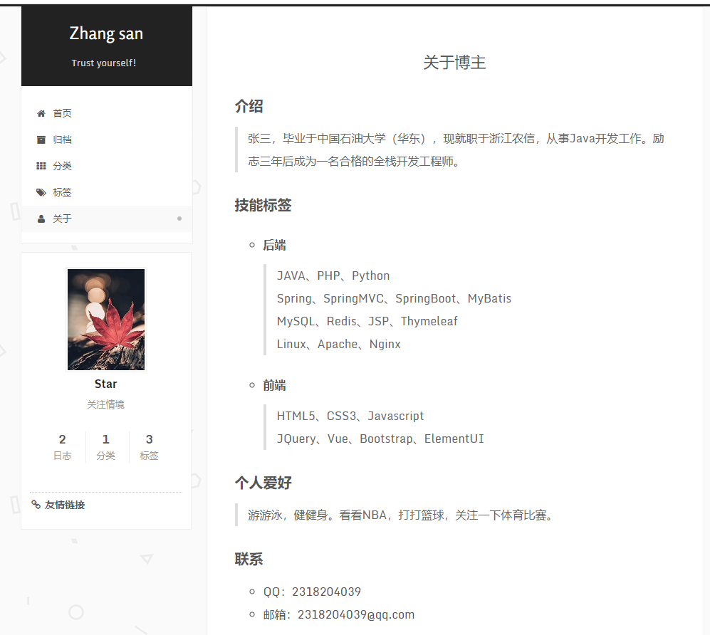
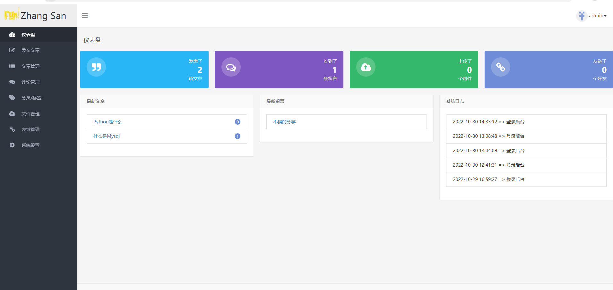
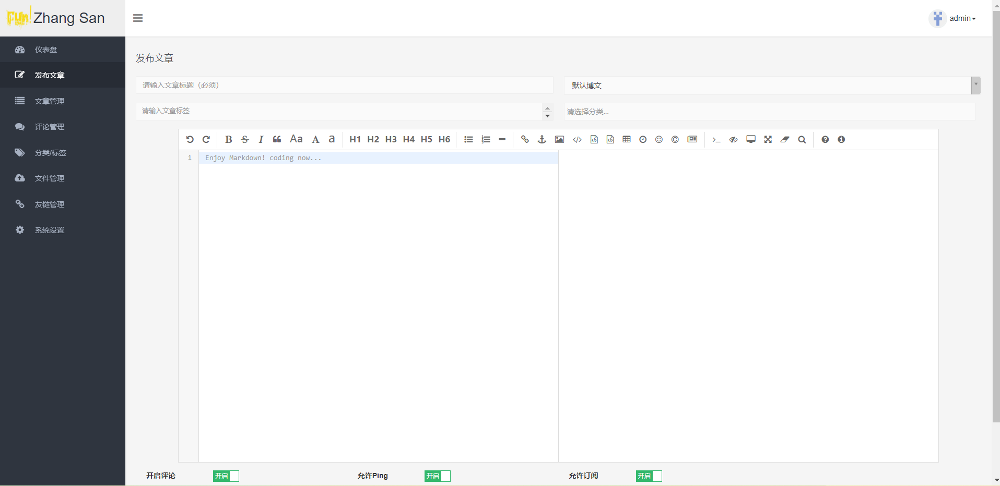
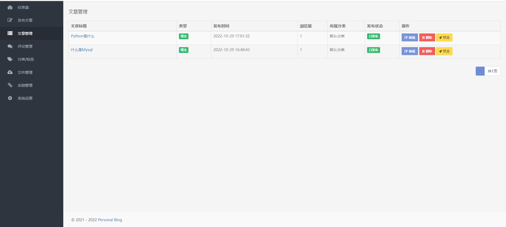
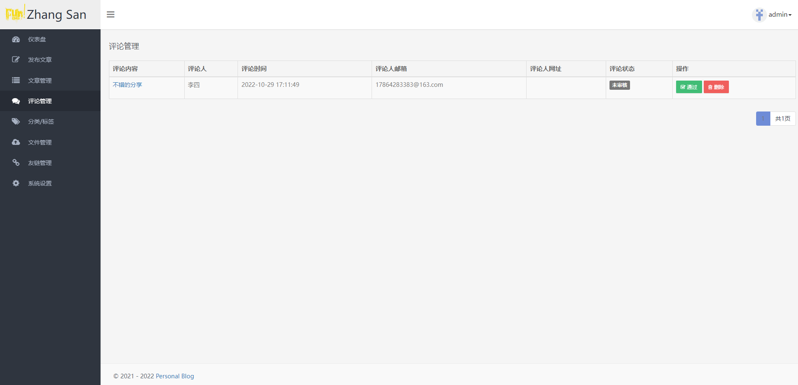
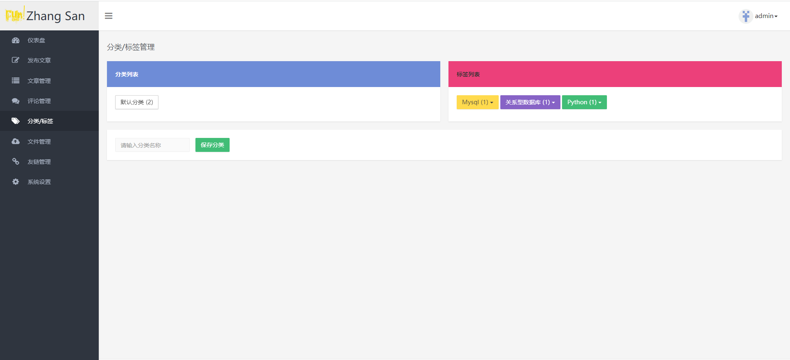

# Zhangsan Blog
## 个人博客系统
Zhangsan Blog是由SpringBoot1.5 + MyBatis + Thymeleaf等技术实现的个人网站。
### 技术栈
#### 后端
* 核心框架：SpringBoot
* 持久层框架：MyBatis
* 模板框架：Thymeleaf
* 分页插件：PageHelper
* 缓存框架：Ehcache
* Markdown：Commonmark

#### 前端
* JS框架：Jquery
* CSS框架：Bootstrap
* 富文本编辑器：editor.md
* 文件上传：dropzone
* 弹框插件：sweetalert

### 预览效果
#### 前端效果

#### 后端效果

### 安装
执行sql文件，然后修改application-dev.yml文件中连接数据库的用户名、密码。运行项目即可。

前端访问地址：http://localhost:8888

后台访问地址：http://localhost:8888/admin 用户名：admin 密码：123456

